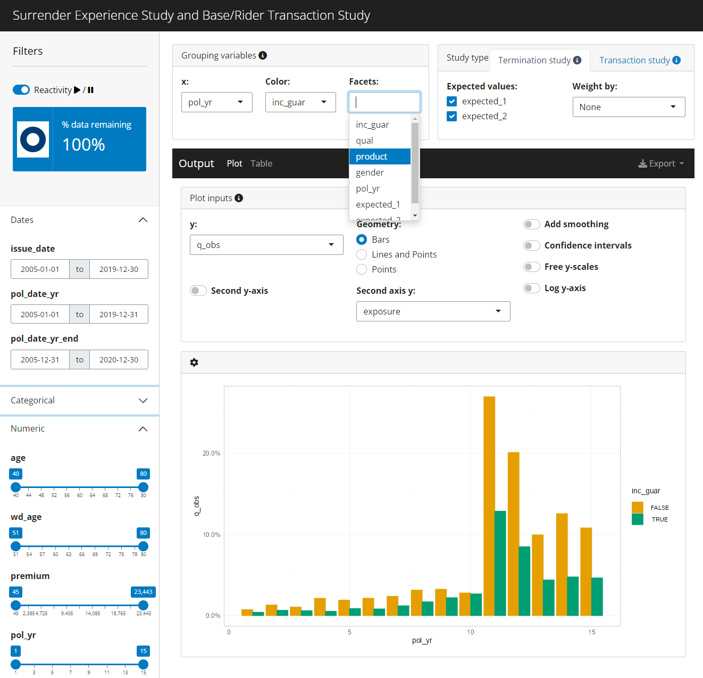

<!-- README.md is generated from README.Rmd. Please edit that file -->

```{r, include = FALSE}
knitr::opts_chunk$set(
  collapse = TRUE,
  comment = "#>",
  fig.path = "man/figures/README-",
  out.width = "100%"
)
```

# actxps

<!-- badges: start -->
[](https://github.com/mattheaphy/actxps/actions/workflows/R-CMD-check.yaml)
<!-- badges: end -->

Experience studies are used by actuaries to explore historical experience across
blocks of business and to inform assumption setting activities. This package 
provides functions for preparing data, creating studies, and beginning assumption development.

## Installation

You can install the development version of `actxps` from [GitHub](https://github.com/) with:

``` r
# install.packages("devtools")
devtools::install_github("mattheaphy/actxps")
```

## Simulated data set

The `actxps` package includes a data frame containing simulated census data for a theoretical deferred annuity product with an optional guaranteed income rider. The grain of this data is one row per policy.

```{r, warning=FALSE}
library(actxps)
library(dplyr)

census_dat
```

The data includes 3 policy statuses: Active, Death, and Surrender.

```{r}
(status_counts <- table(census_dat$status))
```

Let's assume we're interested in calculating the probability of surrender over one policy year. We cannot simply calculate the proportion of policies in a surrendered status as this does not represent an annualized surrender rate. 

```{r}
prop.table(status_counts)
```

## Creating exposed data

In order to calculate annual surrender rates, we need to break each policy into multiple records. There should be one row per policy per year.

The `expose_` family of functions is used to perform this transformation. 


```{r example}
exposed_data <- expose(census_dat, end_date = "2019-12-31", 
                        target_status = "Surrender")

exposed_data
```

Now that the data has been "exposed" by policy year, the observed annual surrender probability can be calculated as:

```{r}
sum(exposed_data$status == "Surrender") / sum(exposed_data$exposure)
```

As a default, the `expose` function calculate exposures by policy year. This can also be accomplished with the function `expose_py`. Other implementations of `expose` include:

- `expose_cy` = exposures by calendar year
- `expose_cq` = exposures by calendar quarter
- `expose_pm` = exposures by policy month
- `expose_cm` = exposures by calendar month

All `expose_` functions return `exposed_df` objects.

## Experience study summary function

The `exp_stats` function creates a summary of observed experience data. The output of this function is an `exp_df` object.

```{r}
exp_stats(exposed_data)
```

### Grouped experience data

If the data frame passed into `exp_stats` is grouped, the resulting output will contain one record for each unique group.

```{r}
library(dplyr)

exp_res <- exposed_data |> 
  group_by(pol_yr, inc_guar) |> 
  exp_stats()

exp_res
```

### Actual-to-expected rates

To derive actual-to-expected rates, first attach one or more columns of expected termination rates to the exposure data. Then, pass these column names to the `expected` argument of `exp_stats`.

```{r}

expected_table <- c(seq(0.005, 0.03, length.out = 10), 0.2, 0.15, rep(0.05, 3))


exposed_data <- exposed_data |> 
  mutate(expected_1 = expected_table[pol_yr],
         expected_2 = ifelse(exposed_data$inc_guar, 0.015, 0.03))

exp_res <- exposed_data |> 
  group_by(pol_yr, inc_guar) |> 
  exp_stats(expected = c("expected_1", "expected_2"))

exp_res

```

### `autoplot()` and `autotable()`

The `autoplot()` and `autotable()` functions can be used to create prebuilt visualizations and summary tables.

```{r, warning=FALSE, message=FALSE, dpi = 400}

library(ggplot2)

.colors <- c("#eb15e4", "#7515eb")
theme_set(theme_light())

exp_res |> 
  autoplot() + 
  scale_color_manual(values = .colors) + 
  labs(title = "Observed Surrender Rates by Policy Year and Income Guarantee Presence")

```

```{r, eval = FALSE}
autotable(exp_res)
```

```{r, echo = FALSE}
autotable(exp_res) |> gt::gtsave(paste0(tempfile(), ".png"))

```


### `summary()`

Calling the `summary` function on an `exp_df` object re-summarizes experience results. This also produces an `exp_df` object.

```{r}
summary(exp_res)
```

If additional variables are passed to `...`, these variables become groups in the re-summarized `exp_df` object.

```{r}
summary(exp_res, inc_guar)
```

## Shiny App

Passing an `exposed_df` object to the `exp_shiny` function launches a shiny app that enables interactive exploration of experience data.

```{r, eval = FALSE}
exp_shiny(exposed_data)
```


