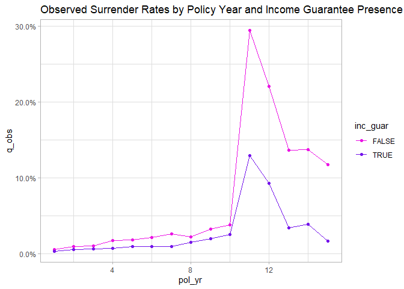

<!-- README.md is generated from README.Rmd. Please edit that file -->

# xps

<!-- badges: start -->
<!-- badges: end -->

Experience studies are used by actuaries to explore historical
experience across blocks of business and to inform assumption setting
activities. This package provides tidyverse-insprired functions for
preparing data, creating studies, and beginning assumption development.

## Installation

You can install the development version of xps from
[GitHub](https://github.com/) with:

``` r
# install.packages("devtools")
devtools::install_github("mattheaphy/xps")
```

## Simulated data set

The `xps` package includes a data frame containing simulated census data
for a theoretical deferred annuity product with an optional guaranteed
income rider. The grain of this data is one row per policy.

``` r
library(xps)
library(dplyr)
#> 
#> Attaching package: 'dplyr'
#> The following objects are masked from 'package:stats':
#> 
#>     filter, lag
#> The following objects are masked from 'package:base':
#> 
#>     intersect, setdiff, setequal, union

census_dat
#> # A tibble: 20,000 x 10
#>    pol_num status    issue_date inc_guar qual    age product gender wd_age
#>      <int> <fct>     <date>     <lgl>    <lgl> <int> <fct>   <fct>   <int>
#>  1       1 Active    2014-12-17 TRUE     FALSE    56 b       F          77
#>  2       2 Surrender 2007-09-24 FALSE    FALSE    71 a       F          71
#>  3       3 Active    2012-10-06 FALSE    TRUE     62 b       F          63
#>  4       4 Surrender 2005-06-27 TRUE     TRUE     62 c       M          62
#>  5       5 Active    2019-11-22 FALSE    FALSE    62 c       F          67
#>  6       6 Active    2018-09-01 FALSE    TRUE     77 a       F          77
#>  7       7 Active    2011-07-23 TRUE     TRUE     63 a       M          65
#>  8       8 Surrender 2005-11-08 TRUE     TRUE     58 a       M          58
#>  9       9 Active    2010-09-19 FALSE    FALSE    53 c       M          64
#> 10      10 Active    2012-05-25 TRUE     FALSE    61 b       M          73
#> # ... with 19,990 more rows, and 1 more variable: term_date <date>
```

The data includes 3 policy statuses: Active, Death, and Surrender.

``` r
(status_counts <- table(census_dat$status))
#> 
#>    Active     Death Surrender 
#>     15195      1860      2945
```

Let’s assume we’re interested in calculating the probability of
surrender over one policy year. We cannot simply calculate the
proportion of policies in a surrendered status as this does not
represent an annualized surrender rate.

``` r
prop.table(status_counts)
#> 
#>    Active     Death Surrender 
#>   0.75975   0.09300   0.14725
```

## Creating exposed data

In order to calculate annual surrender rates, we need to break each
policy into multiple records. There should be one row per policy per
year.

The `expose_` family of functions is used to perform this
transformation.

``` r
exposed_data <- expose(census_dat, end_date = "2019-12-31", 
                        target_status = "Surrender")

exposed_data
#> Exposure data
#> 
#>  Exposure type: policy_year 
#>  Target status: Surrender 
#>  Study range: 1900-01-01 to 2019-12-31 
#> 
#> # A tibble: 141,297 x 13
#>    pol_num status issue_date inc_guar qual    age product gender wd_age
#>  *   <int> <fct>  <date>     <lgl>    <lgl> <int> <fct>   <fct>   <int>
#>  1       1 Active 2014-12-17 TRUE     FALSE    56 b       F          77
#>  2       1 Active 2014-12-17 TRUE     FALSE    56 b       F          77
#>  3       1 Active 2014-12-17 TRUE     FALSE    56 b       F          77
#>  4       1 Active 2014-12-17 TRUE     FALSE    56 b       F          77
#>  5       1 Active 2014-12-17 TRUE     FALSE    56 b       F          77
#>  6       1 Active 2014-12-17 TRUE     FALSE    56 b       F          77
#>  7       2 Active 2007-09-24 FALSE    FALSE    71 a       F          71
#>  8       2 Active 2007-09-24 FALSE    FALSE    71 a       F          71
#>  9       2 Active 2007-09-24 FALSE    FALSE    71 a       F          71
#> 10       2 Active 2007-09-24 FALSE    FALSE    71 a       F          71
#> # ... with 141,287 more rows, and 4 more variables: term_date <date>,
#> #   pol_yr <int>, pol_date_yr <date>, exposure <dbl>
```

Now that the data has been “exposed” by policy year, the observed annual
surrender probability can be calculated as:

``` r
sum(exposed_data$status == "Surrender") / sum(exposed_data$exposure)
#> [1] 0.02145196
```

As a default, the `expose` function calculate exposures by policy year.
This can also be accomplished with the function `expose_py`. Other
implementations of `expose` include:

-   `expose_cy` = exposures by calendar year
-   `expose_cq` = exposures by calendar quarter
-   `expose_pm` = exposures by policy month
-   `expose_cm` = exposures by calendar month

## Experience study summary function

The `exp_stats` function can be used to create a summary of observed
experience data.

``` r
exp_stats(exposed_data)
#> Experience study results
#> 
#>  Groups:  
#>  Target status: Surrender 
#>  Study range: 1900-01-01 to 2019-12-31 
#> 
#> # A tibble: 1 x 3
#>   claims exposure  q_obs
#> *  <int>    <dbl>  <dbl>
#> 1   2846  132669. 0.0215
```

If the data frame passed into `exp_stats` is grouped, the resulting
output will contain one record for each unique group.

``` r
library(dplyr)

exp_res <- exposed_data |> 
  group_by(pol_yr, inc_guar) |> 
  exp_stats()

exp_res
#> Experience study results
#> 
#>  Groups: pol_yr, inc_guar 
#>  Target status: Surrender 
#>  Study range: 1900-01-01 to 2019-12-31 
#> 
#> # A tibble: 30 x 5
#>    pol_yr inc_guar claims exposure   q_obs
#>  *  <int> <lgl>     <int>    <dbl>   <dbl>
#>  1      1 FALSE        42    7719. 0.00544
#>  2      1 TRUE         38   11526. 0.00330
#>  3      2 FALSE        65    7117. 0.00913
#>  4      2 TRUE         61   10605. 0.00575
#>  5      3 FALSE        67    6476. 0.0103 
#>  6      3 TRUE         60    9626. 0.00623
#>  7      4 FALSE       103    5823. 0.0177 
#>  8      4 TRUE         58    8697. 0.00667
#>  9      5 FALSE        94    5147. 0.0183 
#> 10      5 TRUE         72    7779. 0.00926
#> # ... with 20 more rows
```

The `autoplot()` and `autotable()` functions can be used to create
pre-built visualizations and summary tables.

``` r
library(ggplot2)

.colors <- c("#eb15e4", "#7515eb")
theme_set(theme_light())

exp_res |> 
  autoplot() + 
  scale_color_manual(values = .colors) + 
  labs(title = "Observed Surrender Rates by Policy Year and Income Guarantee Presence")
```



``` r
autotable(exp_res)
```

<div id="ijxeghsbfz" style="overflow-x:auto;overflow-y:auto;width:auto;height:auto;">
<style>html {
  font-family: -apple-system, BlinkMacSystemFont, 'Segoe UI', Roboto, Oxygen, Ubuntu, Cantarell, 'Helvetica Neue', 'Fira Sans', 'Droid Sans', Arial, sans-serif;
}

#ijxeghsbfz .gt_table {
  display: table;
  border-collapse: collapse;
  margin-left: auto;
  margin-right: auto;
  color: #333333;
  font-size: 100%;
  font-weight: normal;
  font-style: normal;
  background-color: #FFFFFF;
  width: auto;
  border-top-style: solid;
  border-top-width: 2px;
  border-top-color: #A8A8A8;
  border-right-style: none;
  border-right-width: 2px;
  border-right-color: #D3D3D3;
  border-bottom-style: solid;
  border-bottom-width: 2px;
  border-bottom-color: #A8A8A8;
  border-left-style: none;
  border-left-width: 2px;
  border-left-color: #D3D3D3;
}

#ijxeghsbfz .gt_heading {
  background-color: #FFFFFF;
  text-align: center;
  border-bottom-color: #FFFFFF;
  border-left-style: none;
  border-left-width: 1px;
  border-left-color: #D3D3D3;
  border-right-style: none;
  border-right-width: 1px;
  border-right-color: #D3D3D3;
}

#ijxeghsbfz .gt_title {
  color: #333333;
  font-size: 125%;
  font-weight: initial;
  padding-top: 4px;
  padding-bottom: 4px;
  padding-left: 5px;
  padding-right: 5px;
  border-bottom-color: #FFFFFF;
  border-bottom-width: 0;
}

#ijxeghsbfz .gt_subtitle {
  color: #333333;
  font-size: 85%;
  font-weight: initial;
  padding-top: 0;
  padding-bottom: 6px;
  padding-left: 5px;
  padding-right: 5px;
  border-top-color: #FFFFFF;
  border-top-width: 0;
}

#ijxeghsbfz .gt_bottom_border {
  border-bottom-style: solid;
  border-bottom-width: 2px;
  border-bottom-color: #D3D3D3;
}

#ijxeghsbfz .gt_col_headings {
  border-top-style: solid;
  border-top-width: 2px;
  border-top-color: #D3D3D3;
  border-bottom-style: solid;
  border-bottom-width: 2px;
  border-bottom-color: #D3D3D3;
  border-left-style: none;
  border-left-width: 1px;
  border-left-color: #D3D3D3;
  border-right-style: none;
  border-right-width: 1px;
  border-right-color: #D3D3D3;
}

#ijxeghsbfz .gt_col_heading {
  color: #333333;
  background-color: #FFFFFF;
  font-size: 100%;
  font-weight: normal;
  text-transform: inherit;
  border-left-style: none;
  border-left-width: 1px;
  border-left-color: #D3D3D3;
  border-right-style: none;
  border-right-width: 1px;
  border-right-color: #D3D3D3;
  vertical-align: bottom;
  padding-top: 5px;
  padding-bottom: 6px;
  padding-left: 5px;
  padding-right: 5px;
  overflow-x: hidden;
}

#ijxeghsbfz .gt_column_spanner_outer {
  color: #333333;
  background-color: #FFFFFF;
  font-size: 100%;
  font-weight: normal;
  text-transform: inherit;
  padding-top: 0;
  padding-bottom: 0;
  padding-left: 4px;
  padding-right: 4px;
}

#ijxeghsbfz .gt_column_spanner_outer:first-child {
  padding-left: 0;
}

#ijxeghsbfz .gt_column_spanner_outer:last-child {
  padding-right: 0;
}

#ijxeghsbfz .gt_column_spanner {
  border-bottom-style: solid;
  border-bottom-width: 2px;
  border-bottom-color: #D3D3D3;
  vertical-align: bottom;
  padding-top: 5px;
  padding-bottom: 5px;
  overflow-x: hidden;
  display: inline-block;
  width: 100%;
}

#ijxeghsbfz .gt_group_heading {
  padding-top: 8px;
  padding-bottom: 8px;
  padding-left: 5px;
  padding-right: 5px;
  color: #333333;
  background-color: #FFFFFF;
  font-size: 100%;
  font-weight: initial;
  text-transform: inherit;
  border-top-style: solid;
  border-top-width: 2px;
  border-top-color: #D3D3D3;
  border-bottom-style: solid;
  border-bottom-width: 2px;
  border-bottom-color: #D3D3D3;
  border-left-style: none;
  border-left-width: 1px;
  border-left-color: #D3D3D3;
  border-right-style: none;
  border-right-width: 1px;
  border-right-color: #D3D3D3;
  vertical-align: middle;
}

#ijxeghsbfz .gt_empty_group_heading {
  padding: 0.5px;
  color: #333333;
  background-color: #FFFFFF;
  font-size: 100%;
  font-weight: initial;
  border-top-style: solid;
  border-top-width: 2px;
  border-top-color: #D3D3D3;
  border-bottom-style: solid;
  border-bottom-width: 2px;
  border-bottom-color: #D3D3D3;
  vertical-align: middle;
}

#ijxeghsbfz .gt_from_md > :first-child {
  margin-top: 0;
}

#ijxeghsbfz .gt_from_md > :last-child {
  margin-bottom: 0;
}

#ijxeghsbfz .gt_row {
  padding-top: 8px;
  padding-bottom: 8px;
  padding-left: 5px;
  padding-right: 5px;
  margin: 10px;
  border-top-style: solid;
  border-top-width: 1px;
  border-top-color: #D3D3D3;
  border-left-style: none;
  border-left-width: 1px;
  border-left-color: #D3D3D3;
  border-right-style: none;
  border-right-width: 1px;
  border-right-color: #D3D3D3;
  vertical-align: middle;
  overflow-x: hidden;
}

#ijxeghsbfz .gt_stub {
  color: #333333;
  background-color: #FFFFFF;
  font-size: 100%;
  font-weight: initial;
  text-transform: inherit;
  border-right-style: solid;
  border-right-width: 2px;
  border-right-color: #D3D3D3;
  padding-left: 5px;
  padding-right: 5px;
}

#ijxeghsbfz .gt_stub_row_group {
  color: #333333;
  background-color: #FFFFFF;
  font-size: 100%;
  font-weight: initial;
  text-transform: inherit;
  border-right-style: solid;
  border-right-width: 2px;
  border-right-color: #D3D3D3;
  padding-left: 5px;
  padding-right: 5px;
  vertical-align: top;
}

#ijxeghsbfz .gt_row_group_first td {
  border-top-width: 2px;
}

#ijxeghsbfz .gt_summary_row {
  color: #333333;
  background-color: #FFFFFF;
  text-transform: inherit;
  padding-top: 8px;
  padding-bottom: 8px;
  padding-left: 5px;
  padding-right: 5px;
}

#ijxeghsbfz .gt_first_summary_row {
  border-top-style: solid;
  border-top-color: #D3D3D3;
}

#ijxeghsbfz .gt_first_summary_row.thick {
  border-top-width: 2px;
}

#ijxeghsbfz .gt_last_summary_row {
  padding-top: 8px;
  padding-bottom: 8px;
  padding-left: 5px;
  padding-right: 5px;
  border-bottom-style: solid;
  border-bottom-width: 2px;
  border-bottom-color: #D3D3D3;
}

#ijxeghsbfz .gt_grand_summary_row {
  color: #333333;
  background-color: #FFFFFF;
  text-transform: inherit;
  padding-top: 8px;
  padding-bottom: 8px;
  padding-left: 5px;
  padding-right: 5px;
}

#ijxeghsbfz .gt_first_grand_summary_row {
  padding-top: 8px;
  padding-bottom: 8px;
  padding-left: 5px;
  padding-right: 5px;
  border-top-style: double;
  border-top-width: 6px;
  border-top-color: #D3D3D3;
}

#ijxeghsbfz .gt_striped {
  background-color: rgba(128, 128, 128, 0.05);
}

#ijxeghsbfz .gt_table_body {
  border-top-style: solid;
  border-top-width: 2px;
  border-top-color: #D3D3D3;
  border-bottom-style: solid;
  border-bottom-width: 2px;
  border-bottom-color: #D3D3D3;
}

#ijxeghsbfz .gt_footnotes {
  color: #333333;
  background-color: #FFFFFF;
  border-bottom-style: none;
  border-bottom-width: 2px;
  border-bottom-color: #D3D3D3;
  border-left-style: none;
  border-left-width: 2px;
  border-left-color: #D3D3D3;
  border-right-style: none;
  border-right-width: 2px;
  border-right-color: #D3D3D3;
}

#ijxeghsbfz .gt_footnote {
  margin: 0px;
  font-size: 90%;
  padding-left: 4px;
  padding-right: 4px;
  padding-left: 5px;
  padding-right: 5px;
}

#ijxeghsbfz .gt_sourcenotes {
  color: #333333;
  background-color: #FFFFFF;
  border-bottom-style: none;
  border-bottom-width: 2px;
  border-bottom-color: #D3D3D3;
  border-left-style: none;
  border-left-width: 2px;
  border-left-color: #D3D3D3;
  border-right-style: none;
  border-right-width: 2px;
  border-right-color: #D3D3D3;
}

#ijxeghsbfz .gt_sourcenote {
  font-size: 90%;
  padding-top: 4px;
  padding-bottom: 4px;
  padding-left: 5px;
  padding-right: 5px;
}

#ijxeghsbfz .gt_left {
  text-align: left;
}

#ijxeghsbfz .gt_center {
  text-align: center;
}

#ijxeghsbfz .gt_right {
  text-align: right;
  font-variant-numeric: tabular-nums;
}

#ijxeghsbfz .gt_font_normal {
  font-weight: normal;
}

#ijxeghsbfz .gt_font_bold {
  font-weight: bold;
}

#ijxeghsbfz .gt_font_italic {
  font-style: italic;
}

#ijxeghsbfz .gt_super {
  font-size: 65%;
}

#ijxeghsbfz .gt_two_val_uncert {
  display: inline-block;
  line-height: 1em;
  text-align: right;
  font-size: 60%;
  vertical-align: -0.25em;
  margin-left: 0.1em;
}

#ijxeghsbfz .gt_footnote_marks {
  font-style: italic;
  font-weight: normal;
  font-size: 75%;
  vertical-align: 0.4em;
}

#ijxeghsbfz .gt_asterisk {
  font-size: 100%;
  vertical-align: 0;
}

#ijxeghsbfz .gt_slash_mark {
  font-size: 0.7em;
  line-height: 0.7em;
  vertical-align: 0.15em;
}

#ijxeghsbfz .gt_fraction_numerator {
  font-size: 0.6em;
  line-height: 0.6em;
  vertical-align: 0.45em;
}

#ijxeghsbfz .gt_fraction_denominator {
  font-size: 0.6em;
  line-height: 0.6em;
  vertical-align: -0.05em;
}
</style>
<table class="gt_table">
  
  <thead class="gt_col_headings">
    <tr>
      <th class="gt_col_heading gt_columns_bottom_border gt_right" rowspan="1" colspan="1" style="font-weight: bold;">pol_yr</th>
      <th class="gt_col_heading gt_columns_bottom_border gt_center" rowspan="1" colspan="1" style="font-weight: bold;">inc_guar</th>
      <th class="gt_col_heading gt_columns_bottom_border gt_right" rowspan="1" colspan="1" style="font-weight: bold;">claims</th>
      <th class="gt_col_heading gt_columns_bottom_border gt_right" rowspan="1" colspan="1" style="font-weight: bold;">exposure</th>
      <th class="gt_col_heading gt_columns_bottom_border gt_right" rowspan="1" colspan="1" style="font-weight: bold;">q_obs</th>
    </tr>
  </thead>
  <tbody class="gt_table_body">
    <tr><td class="gt_row gt_right">1</td>
<td class="gt_row gt_center">FALSE</td>
<td class="gt_row gt_right">42</td>
<td class="gt_row gt_right">7,719</td>
<td class="gt_row gt_right">0.5%</td></tr>
    <tr><td class="gt_row gt_right gt_striped">1</td>
<td class="gt_row gt_center gt_striped">TRUE</td>
<td class="gt_row gt_right gt_striped">38</td>
<td class="gt_row gt_right gt_striped">11,526</td>
<td class="gt_row gt_right gt_striped">0.3%</td></tr>
    <tr><td class="gt_row gt_right">2</td>
<td class="gt_row gt_center">FALSE</td>
<td class="gt_row gt_right">65</td>
<td class="gt_row gt_right">7,117</td>
<td class="gt_row gt_right">0.9%</td></tr>
    <tr><td class="gt_row gt_right gt_striped">2</td>
<td class="gt_row gt_center gt_striped">TRUE</td>
<td class="gt_row gt_right gt_striped">61</td>
<td class="gt_row gt_right gt_striped">10,605</td>
<td class="gt_row gt_right gt_striped">0.6%</td></tr>
    <tr><td class="gt_row gt_right">3</td>
<td class="gt_row gt_center">FALSE</td>
<td class="gt_row gt_right">67</td>
<td class="gt_row gt_right">6,476</td>
<td class="gt_row gt_right">1.0%</td></tr>
    <tr><td class="gt_row gt_right gt_striped">3</td>
<td class="gt_row gt_center gt_striped">TRUE</td>
<td class="gt_row gt_right gt_striped">60</td>
<td class="gt_row gt_right gt_striped">9,626</td>
<td class="gt_row gt_right gt_striped">0.6%</td></tr>
    <tr><td class="gt_row gt_right">4</td>
<td class="gt_row gt_center">FALSE</td>
<td class="gt_row gt_right">103</td>
<td class="gt_row gt_right">5,823</td>
<td class="gt_row gt_right">1.8%</td></tr>
    <tr><td class="gt_row gt_right gt_striped">4</td>
<td class="gt_row gt_center gt_striped">TRUE</td>
<td class="gt_row gt_right gt_striped">58</td>
<td class="gt_row gt_right gt_striped">8,697</td>
<td class="gt_row gt_right gt_striped">0.7%</td></tr>
    <tr><td class="gt_row gt_right">5</td>
<td class="gt_row gt_center">FALSE</td>
<td class="gt_row gt_right">94</td>
<td class="gt_row gt_right">5,147</td>
<td class="gt_row gt_right">1.8%</td></tr>
    <tr><td class="gt_row gt_right gt_striped">5</td>
<td class="gt_row gt_center gt_striped">TRUE</td>
<td class="gt_row gt_right gt_striped">72</td>
<td class="gt_row gt_right gt_striped">7,779</td>
<td class="gt_row gt_right gt_striped">0.9%</td></tr>
    <tr><td class="gt_row gt_right">6</td>
<td class="gt_row gt_center">FALSE</td>
<td class="gt_row gt_right">98</td>
<td class="gt_row gt_right">4,530</td>
<td class="gt_row gt_right">2.2%</td></tr>
    <tr><td class="gt_row gt_right gt_striped">6</td>
<td class="gt_row gt_center gt_striped">TRUE</td>
<td class="gt_row gt_right gt_striped">65</td>
<td class="gt_row gt_right gt_striped">6,854</td>
<td class="gt_row gt_right gt_striped">0.9%</td></tr>
    <tr><td class="gt_row gt_right">7</td>
<td class="gt_row gt_center">FALSE</td>
<td class="gt_row gt_right">101</td>
<td class="gt_row gt_right">3,930</td>
<td class="gt_row gt_right">2.6%</td></tr>
    <tr><td class="gt_row gt_right gt_striped">7</td>
<td class="gt_row gt_center gt_striped">TRUE</td>
<td class="gt_row gt_right gt_striped">54</td>
<td class="gt_row gt_right gt_striped">5,982</td>
<td class="gt_row gt_right gt_striped">0.9%</td></tr>
    <tr><td class="gt_row gt_right">8</td>
<td class="gt_row gt_center">FALSE</td>
<td class="gt_row gt_right">72</td>
<td class="gt_row gt_right">3,308</td>
<td class="gt_row gt_right">2.2%</td></tr>
    <tr><td class="gt_row gt_right gt_striped">8</td>
<td class="gt_row gt_center gt_striped">TRUE</td>
<td class="gt_row gt_right gt_striped">75</td>
<td class="gt_row gt_right gt_striped">5,146</td>
<td class="gt_row gt_right gt_striped">1.5%</td></tr>
    <tr><td class="gt_row gt_right">9</td>
<td class="gt_row gt_center">FALSE</td>
<td class="gt_row gt_right">88</td>
<td class="gt_row gt_right">2,726</td>
<td class="gt_row gt_right">3.2%</td></tr>
    <tr><td class="gt_row gt_right gt_striped">9</td>
<td class="gt_row gt_center gt_striped">TRUE</td>
<td class="gt_row gt_right gt_striped">83</td>
<td class="gt_row gt_right gt_striped">4,289</td>
<td class="gt_row gt_right gt_striped">1.9%</td></tr>
    <tr><td class="gt_row gt_right">10</td>
<td class="gt_row gt_center">FALSE</td>
<td class="gt_row gt_right">84</td>
<td class="gt_row gt_right">2,195</td>
<td class="gt_row gt_right">3.8%</td></tr>
    <tr><td class="gt_row gt_right gt_striped">10</td>
<td class="gt_row gt_center gt_striped">TRUE</td>
<td class="gt_row gt_right gt_striped">88</td>
<td class="gt_row gt_right gt_striped">3,468</td>
<td class="gt_row gt_right gt_striped">2.5%</td></tr>
    <tr><td class="gt_row gt_right">11</td>
<td class="gt_row gt_center">FALSE</td>
<td class="gt_row gt_right">503</td>
<td class="gt_row gt_right">1,711</td>
<td class="gt_row gt_right">29.4%</td></tr>
    <tr><td class="gt_row gt_right gt_striped">11</td>
<td class="gt_row gt_center gt_striped">TRUE</td>
<td class="gt_row gt_right gt_striped">350</td>
<td class="gt_row gt_right gt_striped">2,713</td>
<td class="gt_row gt_right gt_striped">12.9%</td></tr>
    <tr><td class="gt_row gt_right">12</td>
<td class="gt_row gt_center">FALSE</td>
<td class="gt_row gt_right">193</td>
<td class="gt_row gt_right">876</td>
<td class="gt_row gt_right">22.0%</td></tr>
    <tr><td class="gt_row gt_right gt_striped">12</td>
<td class="gt_row gt_center gt_striped">TRUE</td>
<td class="gt_row gt_right gt_striped">163</td>
<td class="gt_row gt_right gt_striped">1,757</td>
<td class="gt_row gt_right gt_striped">9.3%</td></tr>
    <tr><td class="gt_row gt_right">13</td>
<td class="gt_row gt_center">FALSE</td>
<td class="gt_row gt_right">64</td>
<td class="gt_row gt_right">470</td>
<td class="gt_row gt_right">13.6%</td></tr>
    <tr><td class="gt_row gt_right gt_striped">13</td>
<td class="gt_row gt_center gt_striped">TRUE</td>
<td class="gt_row gt_right gt_striped">38</td>
<td class="gt_row gt_right gt_striped">1,109</td>
<td class="gt_row gt_right gt_striped">3.4%</td></tr>
    <tr><td class="gt_row gt_right">14</td>
<td class="gt_row gt_center">FALSE</td>
<td class="gt_row gt_right">33</td>
<td class="gt_row gt_right">241</td>
<td class="gt_row gt_right">13.7%</td></tr>
    <tr><td class="gt_row gt_right gt_striped">14</td>
<td class="gt_row gt_center gt_striped">TRUE</td>
<td class="gt_row gt_right gt_striped">23</td>
<td class="gt_row gt_right gt_striped">596</td>
<td class="gt_row gt_right gt_striped">3.9%</td></tr>
    <tr><td class="gt_row gt_right">15</td>
<td class="gt_row gt_center">FALSE</td>
<td class="gt_row gt_right">8</td>
<td class="gt_row gt_right">68</td>
<td class="gt_row gt_right">11.7%</td></tr>
    <tr><td class="gt_row gt_right gt_striped">15</td>
<td class="gt_row gt_center gt_striped">TRUE</td>
<td class="gt_row gt_right gt_striped">3</td>
<td class="gt_row gt_right gt_striped">185</td>
<td class="gt_row gt_right gt_striped">1.6%</td></tr>
  </tbody>
  
  
</table>
</div>

To derive actual-to-expected rates, attach one or more columns of
expected termination rates to the exposure data. Then, pass these column
names to the `expected` argument of `exp_stats`.

``` r
exposed_data$exp_surr <- ifelse(exposed_data$inc_guar, 0.015, 0.03)

exp_res <- exposed_data |> 
  group_by(pol_yr, inc_guar) |> 
  exp_stats(expected = "exp_surr")

exp_res
#> Experience study results
#> 
#>  Groups: pol_yr, inc_guar 
#>  Target status: Surrender 
#>  Study range: 1900-01-01 to 2019-12-31 
#> 
#> # A tibble: 30 x 7
#>    pol_yr inc_guar claims exp_surr exposure   q_obs ae_exp_surr
#>  *  <int> <lgl>     <int>    <dbl>    <dbl>   <dbl>       <dbl>
#>  1      1 FALSE        42    0.03     7719. 0.00544       0.181
#>  2      1 TRUE         38    0.015   11526. 0.00330       0.220
#>  3      2 FALSE        65    0.03     7117. 0.00913       0.304
#>  4      2 TRUE         61    0.015   10605. 0.00575       0.383
#>  5      3 FALSE        67    0.03     6476. 0.0103        0.345
#>  6      3 TRUE         60    0.015    9626. 0.00623       0.416
#>  7      4 FALSE       103    0.03     5823. 0.0177        0.590
#>  8      4 TRUE         58    0.015    8697. 0.00667       0.445
#>  9      5 FALSE        94    0.03     5147. 0.0183        0.609
#> 10      5 TRUE         72    0.015    7779. 0.00926       0.617
#> # ... with 20 more rows
```
