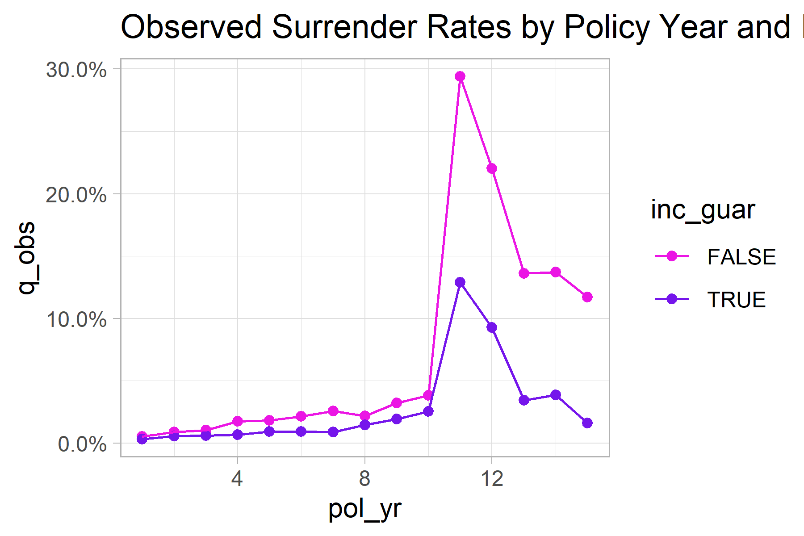
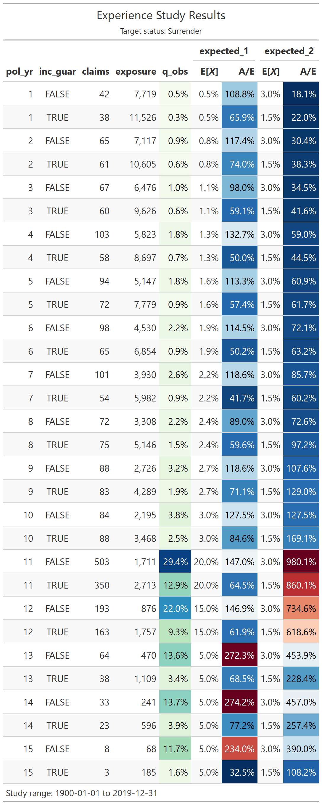

<!-- README.md is generated from README.Rmd. Please edit that file -->

# actxps

<!-- badges: start -->

[](https://github.com/mattheaphy/actxps/actions/workflows/R-CMD-check.yaml)
<!-- badges: end -->

Experience studies are used by actuaries to explore historical
experience across blocks of business and to inform assumption setting
activities. This package provides functions for preparing data, creating
studies, and beginning assumption development.

## Installation

You can install the development version of `actxps` from
[GitHub](https://github.com/) with:

``` r
# install.packages("devtools")
devtools::install_github("mattheaphy/actxps")
```

## Simulated data set

The `actxps` package includes a data frame containing simulated census
data for a theoretical deferred annuity product with an optional
guaranteed income rider. The grain of this data is one row per policy.

``` r
library(actxps)
library(dplyr)
#> 
#> Attaching package: 'dplyr'
#> The following objects are masked from 'package:stats':
#> 
#>     filter, lag
#> The following objects are masked from 'package:base':
#> 
#>     intersect, setdiff, setequal, union

census_dat
#> # A tibble: 20,000 x 10
#>    pol_num status    issue_date inc_guar qual    age product gender wd_age
#>      <int> <fct>     <date>     <lgl>    <lgl> <int> <fct>   <fct>   <int>
#>  1       1 Active    2014-12-17 TRUE     FALSE    56 b       F          77
#>  2       2 Surrender 2007-09-24 FALSE    FALSE    71 a       F          71
#>  3       3 Active    2012-10-06 FALSE    TRUE     62 b       F          63
#>  4       4 Surrender 2005-06-27 TRUE     TRUE     62 c       M          62
#>  5       5 Active    2019-11-22 FALSE    FALSE    62 c       F          67
#>  6       6 Active    2018-09-01 FALSE    TRUE     77 a       F          77
#>  7       7 Active    2011-07-23 TRUE     TRUE     63 a       M          65
#>  8       8 Surrender 2005-11-08 TRUE     TRUE     58 a       M          58
#>  9       9 Active    2010-09-19 FALSE    FALSE    53 c       M          64
#> 10      10 Active    2012-05-25 TRUE     FALSE    61 b       M          73
#> # ... with 19,990 more rows, and 1 more variable: term_date <date>
```

The data includes 3 policy statuses: Active, Death, and Surrender.

``` r
(status_counts <- table(census_dat$status))
#> 
#>    Active     Death Surrender 
#>     15195      1860      2945
```

Let’s assume we’re interested in calculating the probability of
surrender over one policy year. We cannot simply calculate the
proportion of policies in a surrendered status as this does not
represent an annualized surrender rate.

``` r
prop.table(status_counts)
#> 
#>    Active     Death Surrender 
#>   0.75975   0.09300   0.14725
```

## Creating exposed data

In order to calculate annual surrender rates, we need to break each
policy into multiple records. There should be one row per policy per
year.

The `expose_` family of functions is used to perform this
transformation.

``` r
exposed_data <- expose(census_dat, end_date = "2019-12-31", 
                        target_status = "Surrender")

exposed_data
#> Exposure data
#> 
#>  Exposure type: policy_year 
#>  Target status: Surrender 
#>  Study range: 1900-01-01 to 2019-12-31 
#> 
#> # A tibble: 141,297 x 13
#>    pol_num status issue_date inc_guar qual    age product gender wd_age
#>  *   <int> <fct>  <date>     <lgl>    <lgl> <int> <fct>   <fct>   <int>
#>  1       1 Active 2014-12-17 TRUE     FALSE    56 b       F          77
#>  2       1 Active 2014-12-17 TRUE     FALSE    56 b       F          77
#>  3       1 Active 2014-12-17 TRUE     FALSE    56 b       F          77
#>  4       1 Active 2014-12-17 TRUE     FALSE    56 b       F          77
#>  5       1 Active 2014-12-17 TRUE     FALSE    56 b       F          77
#>  6       1 Active 2014-12-17 TRUE     FALSE    56 b       F          77
#>  7       2 Active 2007-09-24 FALSE    FALSE    71 a       F          71
#>  8       2 Active 2007-09-24 FALSE    FALSE    71 a       F          71
#>  9       2 Active 2007-09-24 FALSE    FALSE    71 a       F          71
#> 10       2 Active 2007-09-24 FALSE    FALSE    71 a       F          71
#> # ... with 141,287 more rows, and 4 more variables: term_date <date>,
#> #   pol_yr <int>, pol_date_yr <date>, exposure <dbl>
```

Now that the data has been “exposed” by policy year, the observed annual
surrender probability can be calculated as:

``` r
sum(exposed_data$status == "Surrender") / sum(exposed_data$exposure)
#> [1] 0.02145196
```

As a default, the `expose` function calculate exposures by policy year.
This can also be accomplished with the function `expose_py`. Other
implementations of `expose` include:

-   `expose_cy` = exposures by calendar year
-   `expose_cq` = exposures by calendar quarter
-   `expose_pm` = exposures by policy month
-   `expose_cm` = exposures by calendar month

All `expose_` functions return `exposed_df` objects.

## Experience study summary function

The `exp_stats` function creates a summary of observed experience data.
The output of this function is an `exp_df` object.

``` r
exp_stats(exposed_data)
#> Experience study results
#> 
#>  Groups:  
#>  Target status: Surrender 
#>  Study range: 1900-01-01 to 2019-12-31 
#> 
#> # A tibble: 1 x 4
#>   n_claims claims exposure  q_obs
#> *    <int>  <int>    <dbl>  <dbl>
#> 1     2846   2846  132669. 0.0215
```

### Grouped experience data

If the data frame passed into `exp_stats` is grouped, the resulting
output will contain one record for each unique group.

``` r
library(dplyr)

exp_res <- exposed_data |> 
  group_by(pol_yr, inc_guar) |> 
  exp_stats()

exp_res
#> Experience study results
#> 
#>  Groups: pol_yr, inc_guar 
#>  Target status: Surrender 
#>  Study range: 1900-01-01 to 2019-12-31 
#> 
#> # A tibble: 30 x 6
#>    pol_yr inc_guar n_claims claims exposure   q_obs
#>  *  <int> <lgl>       <int>  <int>    <dbl>   <dbl>
#>  1      1 FALSE          42     42    7719. 0.00544
#>  2      1 TRUE           38     38   11526. 0.00330
#>  3      2 FALSE          65     65    7117. 0.00913
#>  4      2 TRUE           61     61   10605. 0.00575
#>  5      3 FALSE          67     67    6476. 0.0103 
#>  6      3 TRUE           60     60    9626. 0.00623
#>  7      4 FALSE         103    103    5823. 0.0177 
#>  8      4 TRUE           58     58    8697. 0.00667
#>  9      5 FALSE          94     94    5147. 0.0183 
#> 10      5 TRUE           72     72    7779. 0.00926
#> # ... with 20 more rows
```

### Actual-to-expected rates

To derive actual-to-expected rates, first attach one or more columns of
expected termination rates to the exposure data. Then, pass these column
names to the `expected` argument of `exp_stats`.

``` r

expected_table <- c(seq(0.005, 0.03, length.out = 10), 0.2, 0.15, rep(0.05, 3))


exposed_data <- exposed_data |> 
  mutate(expected_1 = expected_table[pol_yr],
         expected_2 = ifelse(exposed_data$inc_guar, 0.015, 0.03))

exp_res <- exposed_data |> 
  group_by(pol_yr, inc_guar) |> 
  exp_stats(expected = c("expected_1", "expected_2"))

exp_res
#> Experience study results
#> 
#>  Groups: pol_yr, inc_guar 
#>  Target status: Surrender 
#>  Study range: 1900-01-01 to 2019-12-31 
#>  Expected values: expected_1, expected_2 
#> 
#> # A tibble: 30 x 10
#>    pol_yr inc_guar n_claims claims exposure   q_obs expected_1 expected_2
#>  *  <int> <lgl>       <int>  <int>    <dbl>   <dbl>      <dbl>      <dbl>
#>  1      1 FALSE          42     42    7719. 0.00544    0.005        0.03 
#>  2      1 TRUE           38     38   11526. 0.00330    0.005        0.015
#>  3      2 FALSE          65     65    7117. 0.00913    0.00778      0.03 
#>  4      2 TRUE           61     61   10605. 0.00575    0.00778      0.015
#>  5      3 FALSE          67     67    6476. 0.0103     0.0106       0.03 
#>  6      3 TRUE           60     60    9626. 0.00623    0.0106       0.015
#>  7      4 FALSE         103    103    5823. 0.0177     0.0133       0.03 
#>  8      4 TRUE           58     58    8697. 0.00667    0.0133       0.015
#>  9      5 FALSE          94     94    5147. 0.0183     0.0161       0.03 
#> 10      5 TRUE           72     72    7779. 0.00926    0.0161       0.015
#> # ... with 20 more rows, and 2 more variables: ae_expected_1 <dbl>,
#> #   ae_expected_2 <dbl>
```

### `autoplot()` and `autotable()`

The `autoplot()` and `autotable()` functions can be used to create
prebuilt visualizations and summary tables.

``` r

library(ggplot2)

.colors <- c("#eb15e4", "#7515eb")
theme_set(theme_light())

exp_res |> 
  autoplot() + 
  scale_color_manual(values = .colors) + 
  labs(title = "Observed Surrender Rates by Policy Year and Income Guarantee Presence")
```



``` r
autotable(exp_res)
```



### `summary()`

Calling the `summary` function on an `exp_df` object re-summarizes
experience results. This also produces an `exp_df` object.

``` r
summary(exp_res)
#> Experience study results
#> 
#>  Groups:  
#>  Target status: Surrender 
#>  Study range: 1900-01-01 to 2019-12-31 
#>  Expected values: expected_1, expected_2 
#> 
#> # A tibble: 1 x 8
#>   n_claims claims exposure  q_obs expected_1 expected_2 ae_expected_1
#> *    <int>  <int>    <dbl>  <dbl>      <dbl>      <dbl>         <dbl>
#> 1     2846   2846  132669. 0.0215     0.0242     0.0209         0.885
#> # ... with 1 more variable: ae_expected_2 <dbl>
```

If additional variables are passed to `...`, these variables become
groups in the re-summarized `exp_df` object.

``` r
summary(exp_res, inc_guar)
#> Experience study results
#> 
#>  Groups: inc_guar 
#>  Target status: Surrender 
#>  Study range: 1900-01-01 to 2019-12-31 
#>  Expected values: expected_1, expected_2 
#> 
#> # A tibble: 2 x 9
#>   inc_guar n_claims claims exposure  q_obs expected_1 expected_2 ae_expected_1
#> * <lgl>       <int>  <int>    <dbl>  <dbl>      <dbl>      <dbl>         <dbl>
#> 1 FALSE        1615   1615   52338. 0.0309     0.0234      0.03          1.32 
#> 2 TRUE         1231   1231   80331. 0.0153     0.0248      0.015         0.619
#> # ... with 1 more variable: ae_expected_2 <dbl>
```

## Shiny App

Passing an `exposed_df` object to the `exp_shiny` function launches a
shiny app that enables interactive exploration of experience data.

``` r
exp_shiny(exposed_data)
```


