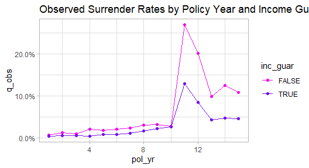
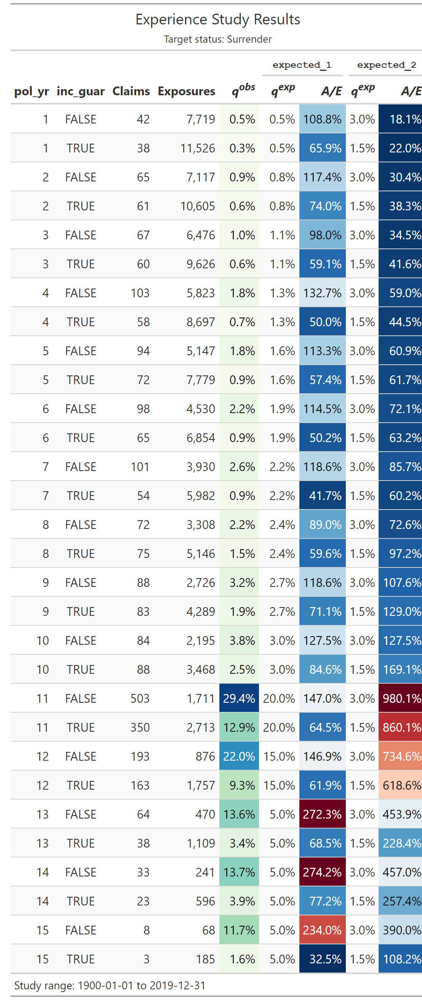
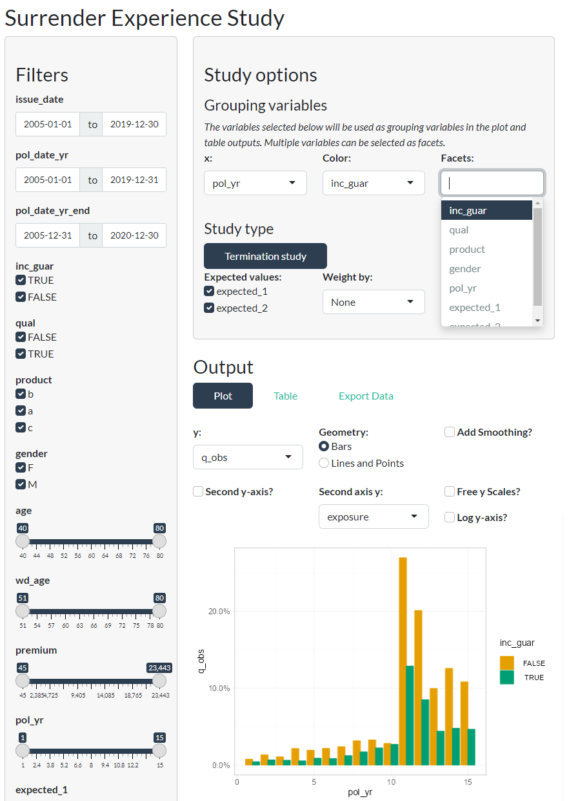

<!-- README.md is generated from README.Rmd. Please edit that file -->

# actxps <a href="https://mattheaphy.github.io/actxps/"></a>

<!-- badges: start -->

[](https://github.com/mattheaphy/actxps/actions/workflows/R-CMD-check.yaml)
<!-- badges: end -->

The actxps package provides a set of tools to assist with the creation
of actuarial experience studies. Experience studies are used by
actuaries to explore historical experience across blocks of business and
to inform assumption setting for projection models.

- The `expose()` family of functions convert census-level records into
  policy or calendar year exposure records.
- The `exp_stats()` function creates experience summary data frames
  containing observed termination rates and claims. Optionally, expected
  termination rates, actual-to-expected ratios, and limited fluctuation
  credibility estimates can also be returned.
- The `add_transactions()` function attaches summarized transactions to
  a data frame with exposure-level records.
- The `trx_stats()` function creates transaction summary data frames
  containing transaction counts, amounts, frequencies, and utilization.
  Optionally, transaction amounts can be expressed as a percentage of
  one or more variables to calculate rates or actual-to-expected ratios.
- The `autoplot()` and `autotable()` functions creates plots and tables
  for reporting.
- The `exp_shiny()` function launches a Shiny app that allows for
  interactive exploration of experience drivers.

## Installation

The actxps package can be installed from CRAN with:

``` r
install.packages("actxps")
```

To install the development version from [GitHub](https://github.com/)
use:

``` r
devtools::install_github("mattheaphy/actxps")
```

## Basic usage

An expanded version of this demo is available in `vignette("actxps")`.

The actxps package includes simulated census data for a theoretical
deferred annuity product with an optional guaranteed income rider. The
grain of this data is one row *per policy*.

``` r
library(actxps)
library(dplyr)

census_dat
#> # A tibble: 20,000 × 11
#>    pol_num status   issue_date inc_g…¹ qual    age product gender wd_age premium
#>      <int> <fct>    <date>     <lgl>   <lgl> <int> <fct>   <fct>   <int>   <dbl>
#>  1       1 Active   2014-12-17 TRUE    FALSE    56 b       F          77     370
#>  2       2 Surrend… 2007-09-24 FALSE   FALSE    71 a       F          71     708
#>  3       3 Active   2012-10-06 FALSE   TRUE     62 b       F          63     466
#>  4       4 Surrend… 2005-06-27 TRUE    TRUE     62 c       M          62     485
#>  5       5 Active   2019-11-22 FALSE   FALSE    62 c       F          67     978
#>  6       6 Active   2018-09-01 FALSE   TRUE     77 a       F          77    1288
#>  7       7 Active   2011-07-23 TRUE    TRUE     63 a       M          65    1046
#>  8       8 Active   2005-11-08 TRUE    TRUE     58 a       M          58    1956
#>  9       9 Active   2010-09-19 FALSE   FALSE    53 c       M          64    2165
#> 10      10 Active   2012-05-25 TRUE    FALSE    61 b       M          73     609
#> # … with 19,990 more rows, 1 more variable: term_date <date>, and abbreviated
#> #   variable name ¹​inc_guar
```

Convert census records to exposure records with one row *per policy per
year*.

``` r
exposed_data <- expose(census_dat, end_date = "2019-12-31", 
                        target_status = "Surrender")

exposed_data
#> Exposure data
#> 
#>  Exposure type: policy_year 
#>  Target status: Surrender 
#>  Study range: 1900-01-01 to 2019-12-31
#> 
#> # A tibble: 141,252 × 15
#>    pol_num status issue_date inc_guar qual    age product gender wd_age premium
#>  *   <int> <fct>  <date>     <lgl>    <lgl> <int> <fct>   <fct>   <int>   <dbl>
#>  1       1 Active 2014-12-17 TRUE     FALSE    56 b       F          77     370
#>  2       1 Active 2014-12-17 TRUE     FALSE    56 b       F          77     370
#>  3       1 Active 2014-12-17 TRUE     FALSE    56 b       F          77     370
#>  4       1 Active 2014-12-17 TRUE     FALSE    56 b       F          77     370
#>  5       1 Active 2014-12-17 TRUE     FALSE    56 b       F          77     370
#>  6       1 Active 2014-12-17 TRUE     FALSE    56 b       F          77     370
#>  7       2 Active 2007-09-24 FALSE    FALSE    71 a       F          71     708
#>  8       2 Active 2007-09-24 FALSE    FALSE    71 a       F          71     708
#>  9       2 Active 2007-09-24 FALSE    FALSE    71 a       F          71     708
#> 10       2 Active 2007-09-24 FALSE    FALSE    71 a       F          71     708
#> # … with 141,242 more rows, and 5 more variables: term_date <date>,
#> #   pol_yr <int>, pol_date_yr <date>, pol_date_yr_end <date>, exposure <dbl>
```

Create a summary grouped by policy year and the presence of a guaranteed
income rider.

``` r

exp_res <- exposed_data |> 
  group_by(pol_yr, inc_guar) |> 
  exp_stats()

exp_res
#> Experience study results
#> 
#>  Groups: pol_yr, inc_guar 
#>  Target status: Surrender 
#>  Study range: 1900-01-01 to 2019-12-31 
#> 
#> # A tibble: 30 × 6
#>    pol_yr inc_guar n_claims claims exposure   q_obs
#>  *  <int> <lgl>       <int>  <int>    <dbl>   <dbl>
#>  1      1 FALSE          56     56    7720. 0.00725
#>  2      1 TRUE           46     46   11532. 0.00399
#>  3      2 FALSE          92     92    7103. 0.0130 
#>  4      2 TRUE           68     68   10612. 0.00641
#>  5      3 FALSE          67     67    6447. 0.0104 
#>  6      3 TRUE           57     57    9650. 0.00591
#>  7      4 FALSE         123    123    5799. 0.0212 
#>  8      4 TRUE           45     45    8737. 0.00515
#>  9      5 FALSE          97     97    5106. 0.0190 
#> 10      5 TRUE           67     67    7810. 0.00858
#> # … with 20 more rows
```

Calculate actual-to-expected ratios.

First, attach one or more columns of expected termination rates to the
exposure data. Then, pass these column names to the `expected` argument
of `exp_stats()`.

``` r

expected_table <- c(seq(0.005, 0.03, length.out = 10), 0.2, 0.15, rep(0.05, 3))

# using 2 different expected termination rates
exposed_data <- exposed_data |> 
  mutate(expected_1 = expected_table[pol_yr],
         expected_2 = ifelse(exposed_data$inc_guar, 0.015, 0.03))

exp_res <- exposed_data |> 
  group_by(pol_yr, inc_guar) |> 
  exp_stats(expected = c("expected_1", "expected_2"))

exp_res
#> Experience study results
#> 
#>  Groups: pol_yr, inc_guar 
#>  Target status: Surrender 
#>  Study range: 1900-01-01 to 2019-12-31 
#>  Expected values: expected_1, expected_2 
#> 
#> # A tibble: 30 × 10
#>    pol_yr inc_g…¹ n_cla…² claims expos…³   q_obs expec…⁴ expec…⁵ ae_ex…⁶ ae_ex…⁷
#>  *  <int> <lgl>     <int>  <int>   <dbl>   <dbl>   <dbl>   <dbl>   <dbl>   <dbl>
#>  1      1 FALSE        56     56   7720. 0.00725 0.005     0.03    1.45    0.242
#>  2      1 TRUE         46     46  11532. 0.00399 0.005     0.015   0.798   0.266
#>  3      2 FALSE        92     92   7103. 0.0130  0.00778   0.03    1.67    0.432
#>  4      2 TRUE         68     68  10612. 0.00641 0.00778   0.015   0.824   0.427
#>  5      3 FALSE        67     67   6447. 0.0104  0.0106    0.03    0.985   0.346
#>  6      3 TRUE         57     57   9650. 0.00591 0.0106    0.015   0.560   0.394
#>  7      4 FALSE       123    123   5799. 0.0212  0.0133    0.03    1.59    0.707
#>  8      4 TRUE         45     45   8737. 0.00515 0.0133    0.015   0.386   0.343
#>  9      5 FALSE        97     97   5106. 0.0190  0.0161    0.03    1.18    0.633
#> 10      5 TRUE         67     67   7810. 0.00858 0.0161    0.015   0.532   0.572
#> # … with 20 more rows, and abbreviated variable names ¹​inc_guar, ²​n_claims,
#> #   ³​exposure, ⁴​expected_1, ⁵​expected_2, ⁶​ae_expected_1, ⁷​ae_expected_2
```

Create visualizations using the `autoplot()` and `autotable()`
functions.

``` r

library(ggplot2)

.colors <- c("#eb15e4", "#7515eb")
theme_set(theme_light())

exp_res |> 
  autoplot() + 
  scale_color_manual(values = .colors) + 
  labs(title = "Observed Surrender Rates by Policy Year and Income Guarantee Presence")
```



``` r
autotable(exp_res)
```

<center>

</center>

Launch a shiny app to interactively explore experience data.

``` r
exp_shiny(exposed_data)
```



<br> **Logo**

<a href="https://www.freepik.com/free-vector/shine-old-wooden-chest-realistic-composition-transparent-background-with-vintage-coffer-sparkling-particles_7497397.htm#query=treasure&position=7&from_view=search&track=sph">Image
by macrovector</a> on Freepik
