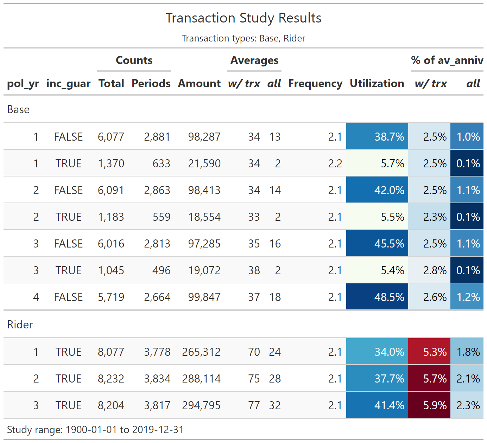

```{r setup, include = FALSE}
knitr::opts_chunk$set(
  collapse = TRUE,
  comment = "#>"
)
```

This article walks through an example of creating a **transaction study** using the actxps package. Unlike a termination study, transaction studies track events that can occur multiple times over the life of a policy. Often, transactions are expected to reoccur; for example, the utilization of a guaranteed income stream.

Key questions to answer in a transaction study are:

- What types of transactions occurred?
- What is the count, amount, and average size of observed transactions?
- What percentage of policies have transactions each exposure period?
- How do transactions compare to expectations?
- What is the rate of transaction amounts as a percentage of another value?

The example below walks through preparing data by adding transaction information to a data frame with exposure-level records using the `add_transactions()` function. Next, study results are summarized using the `trx_stats()` function.

## Simulated transaction and account value data

In this example, we'll be using the `census_dat`, `withdrawals`, and `account_vals` data sets. Each data set is based on a theoretical block of deferred annuity business with a guaranteed lifetime income benefit.

- `census_dat` contains census-level information with one row per policy
- `withdrawals` contains withdrawal transactions. There are 2 types of transactions in the data: "Base" (ordinary withdrawals) and "Rider" (guaranteed income payments).
- `account_vals` contains historical account values on policy anniversaries. This data will be used to calculate withdrawal rates as a percentage of account values.

## The `add_transactions()` function

The `add_transactions()` function attaches transactions to a data frame with exposure-level records. This data frame must have the class `exposed_df`. For our example, we first need to convert `census_dat` into exposure records using the `expose()` function.^[See `vignette('exposures')` for more information on creating `exposed_df` objects.] This example will use policy year exposures.

```{r packages}

library(actxps)
library(dplyr)

exposed_data <- expose_py(census_dat, "2019-12-31", target_status = "Surrender")
exposed_data
```

The `withdrawals` data has 4 columns that are required for attaching transactions:

- `pol_num`: policy number
- `trx_date`: transaction date
- `trx_type`: transaction type
- `trx_amt`: transaction amount

```{r wd-head}
withdrawals
```

The grain of this data is one row per policy per transaction. The expectation is that the number of records in the transaction data will not match the number of rows in the exposure data. That is because policies could have zero or several transactions in a given exposure period.

The `add_transactions()` function uses a non-equivalent join to associate each transaction with a policy number and a date interval found in the exposure data. Then, transaction counts and amounts are summarized such that there is one row per exposure period. In the event there are multiple transaction types found in the data, separate columns are created for each transaction type.

Using our example, we pass both the exposure and withdrawals data to `add_transactions()`. The resulting data has the same number of rows as original exposure data and 4 new columns:

- `trx_amt_Base`: the sum of "Base" withdrawal transactions
- `trx_amt_Rider`: the sum of "Rider" withdrawal transactions
- `trx_n_Base`: the number of "Base" withdrawal transactions
- `trx_n_Rider`: the number of "Rider" withdrawal transactions

```{r add-trx}
exposed_trx <- add_transactions(exposed_data, withdrawals)
glimpse(exposed_trx)
```

If we print `exposed_trx`, we can see that it is still an `exposed_df` object, but now it has an additional attribute for transaction types that have been attached.

```{r print-trx-types}
exposed_trx
```


## The `trx_stats()` function

The actxps package's workhorse function for summarizing transaction experience is `trx_stats()`. This function returns a `trx_df` object, which is a type of data frame containing additional attributes about the transaction study.

At a minimum, a `trx_df` includes the following for each transaction type (`trx_type`):

- The number of transactions (`trx_n`)
- The number of exposure periods with a transaction (`trx_flag`)
- The sum of transactions (`trx_amt`)
- The total exposure (`exposure`)
- The average transaction amount when a transaction occurs (`avg_trx`)
- The average transaction amount across all records (`avg_all`)
- The transaction frequency when a transaction occurs (`trx_freq = trx_n / trx_flag`)
- The transaction utilization (`trx_util = trx_flag / exposure`)

Optionally, a `trx_df` can also include:

- Any grouping variables attached to the input data
- Transaction amounts as a percentage of another value when a transaction occurs (`pct_of_*_w_trx`)
- Transaction amounts as a percentage of another value across all records (`pct_of_*_all`)

To use `trx_stats()`, we simply need to pass it an `exposed_df` object with transactions attached.^[Unlike `exp_stats()`, `trx_stats()` requires data to be an `exposed_df` object.]

```{r trx-basic}
trx_stats(exposed_trx)
```

The results show us that we specified no groups, which is why the output data contains a single row for each transaction type.

### Grouped data

If the data frame passed into `trx_stats()` is grouped using `dplyr::group_by()`, the resulting output will contain one record for each transaction type for each unique group.

In the following, `exposed_trx` is grouped by the presence of an income guarantee (`inc_guar`) before being passed to `trx_stats()`. This results in four rows because we have two types of transactions and two distinct values of `inc_guar`.

```{r grouped-1}

exposed_trx |> 
  group_by(inc_guar) |> 
  trx_stats()

```

Multiple grouping variables are allowed. Below, policy year (`pol_yr`) is added as a second grouping variable.

```{r grouped-2}

exposed_trx |> 
  group_by(pol_yr, inc_guar) |> 
  trx_stats()

```

## Expressing transactions as a percentage of another value

In a transaction study, we often want to express transaction amounts as a percentage of another value. For example, in a withdrawal study, withdrawal amounts divided by account values provides a withdrawal rate. In a study of benefit utilization, transactions can be divided by a maximum benefit amount to derive a benefit utilization rate. In addition, actual-to-expected rates can be calculated by dividing transactions by expected values.

If column names are passed to the `percent_of` argument of `trx_stats()`, the output will contain 4 additional columns for each "percent of" variable:

- The sum of each "percent of" variable
- The sum of each "percent of" variable when a transaction occurs. These columns include the suffix `_w_trx`.
- Transaction amounts divided by each "percent of" variable (`pct_of_{*}_all`)
- Transaction amounts divided by each "percent of" variable when a transaction occurs (`pct_of_{*}_w_trx`)

For our example, let's assume we're interested in examining withdrawal transactions as a percentage of account values, which are available in the `account_vals` data frame in the column `av_anniv`.

```{r pct-of}

# attach account values data
exposed_trx_w_av <- exposed_trx |> 
  left_join(account_vals, by = c("pol_num", "pol_date_yr"))

trx_res <- exposed_trx_w_av |> 
  group_by(pol_yr, inc_guar) |> 
  trx_stats(percent_of = "av_anniv")

glimpse(trx_res)

```


### `autoplot()` and `autotable()`

The `autoplot()` and `autotable()` functions can be used to create visualizations and summary tables from `trx_df` objects.

```{r trx-plot, warning=FALSE, message=FALSE, dpi = 400}

library(ggplot2)

.colors <- c("#eb15e4", "#7515eb")
theme_set(theme_light())

trx_res |>
  # remove periods with zero transactions
  filter(trx_n > 0) |> 
  autoplot(y = pct_of_av_anniv_w_trx) +
  scale_color_manual(values = .colors) +
  labs(title = "Observed Withdrawal Rates by Policy Year and Income Guarantee Presence")

```

```{r trx-table, eval = FALSE}
trx_res |> 
  # remove periods with zero transactions
  filter(trx_n > 0) |> 
  autotable()
```

<center></center>


## Miscellaneous

### Selecting and combining transaction types

The `trx_types` argument of `trx_stats()` can be used to select a subset of transaction types that will appear in the output.

```{r select-trx-type}
trx_stats(exposed_trx, trx_types = "Base")
```

If the `combine_trx` argument is set to `TRUE`, all transaction types will be combined in a group called "All" in the output.

```{r combine-trx}
trx_stats(exposed_trx, combine_trx = TRUE)
```


### Partial exposures are removed as a default

As a default, `trx_stats()` removes partial exposures before summarizing results. This is done to avoid complexity associated with a lopsided skew in the timing of transactions. For example, if transactions can occur on a monthly basis or annually at the beginning of each policy year, partial exposures may not be appropriate. If a policy had an exposure of 0.5 years and was taking withdrawals annually at the beginning of the year, an argument could be made that the exposure should instead be 1 complete year. If the same policy was expected to take withdrawals 9 months into the year, it's not clear if the exposure should be 0.5 years or 0.5 / 0.75 years. To override this treatment, set the `full_exposures_only` argument to `FALSE`.

```{r partial-expo-ok}
trx_stats(exposed_trx, full_exposures_only = FALSE)
```

### Summary method

As noted above, the result of `trx_stats()` is a `trx_df` object. If the `summary()` function is applied to a `trx_df` object, the data will be summarized again and return a higher level `trx_df` object.

If no additional arguments are passed, `summary()` returns a single row of aggregate results for each transaction type.

```{r summary1}
summary(trx_res)
```

If additional variable names are passed to the `summary()` function, then the output will group the data by those variables. In our example, if `pol_yr` is passed to `summary()`, the output will contain one row per policy year for each transaction type.

```{r summary2}
summary(trx_res, pol_yr)
```

Similarly, if `inc_guar` is passed to `summary()`, the output will contain a row for each transaction type and unique value in `inc_guar`.

```{r summary3}
summary(trx_res, inc_guar)
```

### Column names

As a default, `add_transactions()` assumes the transaction data frame (`trx_data`) uses the following naming conventions:

- The policy number column is called `pol_num`
- The transaction date column is called `trx_date`
- The transaction type column is called `trx_type`
- The transaction amount column is called `trx_amt`

These default names can be overridden using the `col_pol_num`, `col_trx_date`, `col_trx_type`, and `col_trx_amt` arguments. 

For example, if the transaction type column was called `transaction_code` in our data, we could write:

```{r col-names-1, eval=FALSE}
exposed_data |> 
  add_transactions(withdrawals, col_trx_type = "transaction_code")
```

Similarly, `trx_stats()` assumes the input data uses the name `exposure` for exposures. This default can be overridden using the argument `col_exposure`.

### Limitations

The `trx_stats()` function does not produce any calculations related to the persistence of transactions from exposure period to exposure period.
